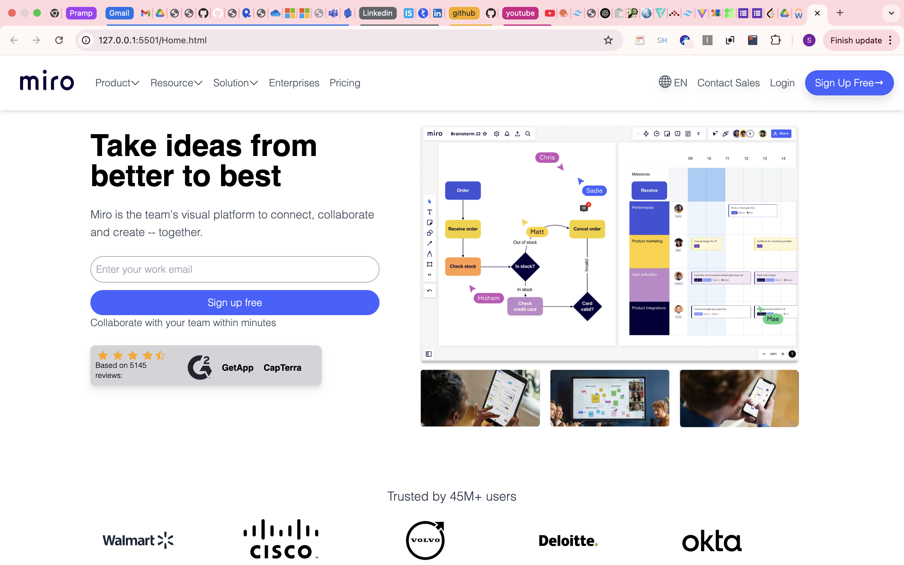

# Responsive Web Project




## Overview

This is a fully responsive web project built with **HTML**, **Tailwind CSS**, and **JavaScript**. It features a modern, responsive design that adapts seamlessly to different screen sizes, making it ideal for both desktop and mobile devices.

The project includes:
- A **Contact Us** page with a fully functional form.
- Comprehensive **form validations**.
- Custom alert notifications for enhanced user experience.
- Integration of custom animations and interactive components.

---

## Features

- **Responsive Design:**  
  The project uses Tailwind CSS for responsive layouts, ensuring that the website looks great on all devices.

- **Contact Us Page:**  
  - A contact form with fields for name, email, message, etc.
  - Real-time validation to provide immediate feedback.
  - Custom alert notifications to inform users about form submission success or errors.

- **Form Validation:**  
  - Client-side validation implemented in JavaScript.
  - Proper error messaging using custom alert components.
  - Utilizes both native HTML validation attributes and custom JavaScript logic.

- **Custom Alerts:**  
  - Designed with custom CSS and JavaScript animations.
  - Alerts provide clear, concise feedback on user actions and errors.

- **Tailwind CSS Integration:**  
  - Fully customized styling with utility-first classes.
  - Easy to modify and extend using Tailwind's configuration.

---

## Technology Stack

- **HTML5**
- **Tailwind CSS**
- **JavaScript (ES6+)**
- **Optional:** Any additional libraries/plugins for animations (e.g., GSAP)

---

## Installation

1. **Clone the Repository:**

   ```bash
   git clone https://github.com/yourusername/responsive-web-project.git
   cd responsive-web-project
